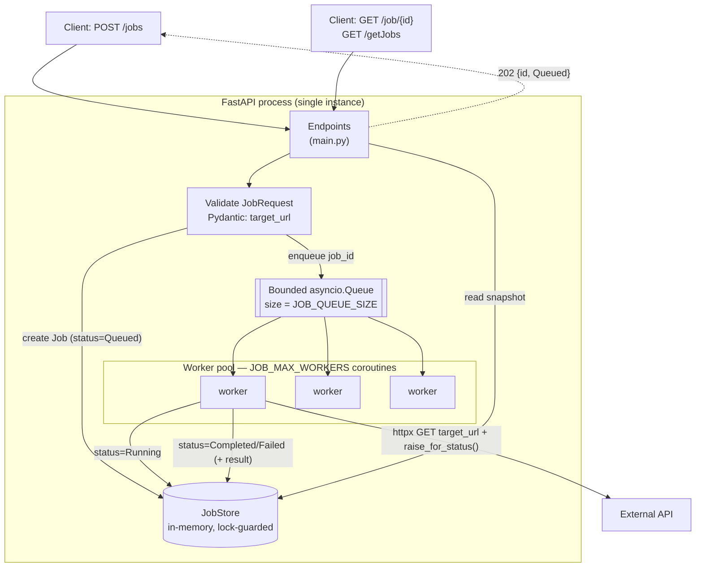
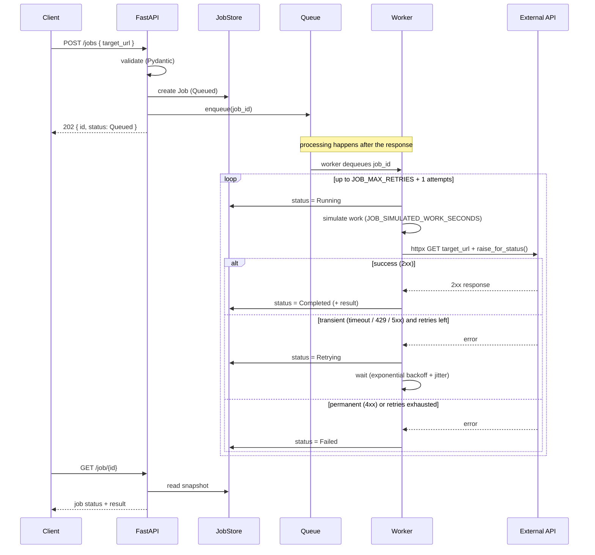

# JobProcessor

A small REST API built with **FastAPI** that accepts jobs and processes them
**asynchronously**. When a job is submitted, the API validates the input,
generates a server-side job id, puts the work on an in-process queue, and
returns immediately with `202 Accepted`. A pool of worker coroutines drains the
queue, calls the job's external `target_url` with `httpx`, and records the
outcome. Clients poll for the result.

- [Architecture](#architecture)
- [Endpoints](#endpoints)
- [Setup](#setup)
- [Execution](#execution)
- [Configuration](#configuration)
- [Testing](#testing)
- [Project layout](#project-layout)
- [Known limitations](#known-limitations)
- [Deployment](#deployment)

## Architecture

HTTP submission flows through a **bounded queue** and is executed by a **worker
pool**, decoupled from the request/response cycle.



### Lifecycle of one job



### Retries & backoff

Failures are classified so only **transient** problems are retried:

| Failure | Classified as | Retried? |
| --- | --- | --- |
| Timeout / connection / DNS error (`httpx.RequestError`) | transient | yes |
| HTTP `429` or any `5xx` | transient | yes |
| HTTP `4xx` (except `429`) | permanent | no |
| Any other/unexpected exception | permanent | no |

A job is retried up to `JOB_MAX_RETRIES` times (so `JOB_MAX_RETRIES + 1` total
attempts). Between attempts it enters the **`Retrying`** state and waits with
**exponential backoff + full jitter**:

```
delay(attempt) = random(0, min(JOB_RETRY_MAX_DELAY,
                                JOB_RETRY_BASE_DELAY * JOB_RETRY_BACKOFF_FACTOR ** attempt))
```

The `attempts` counter on each job records how many tries were made.

Using a queue + worker pool (instead of `BackgroundTasks`) gives:

- **Backpressure** — the queue is bounded (`JOB_QUEUE_SIZE`); when full, `POST
  /jobs` returns `503` instead of accepting unbounded work.
- **A concurrency cap** — at most `JOB_MAX_WORKERS` jobs (and outbound HTTP
  calls) run at once.
- **Decoupling** — processing is independent of the request lifecycle.

The `JobQueue` (`app/queue.py`) and `JobStore` (`app/store.py`) are interfaces,
so a durable, distributed backend can replace the in-memory ones without
touching the endpoints (see [Known limitations](#known-limitations)).

## Endpoints

| Method | Path            | Description                                          |
| ------ | --------------- | ---------------------------------------------------- |
| GET    | `/`             | HTML landing page with links (confirms service is up). |
| POST   | `/jobs`         | Submit a job. Returns `{id, status}` with `202`. `503` if the queue is full. |
| GET    | `/job/{job_id}` | Get one job's status and details. `404` if missing.  |
| GET    | `/getJobs`      | List all jobs and their info.                        |
| GET    | `/health`       | Liveness probe; also reports `queue_depth`.          |

**Job statuses:** `Queued` → `Running` → (`Retrying` ⟳) → `Completed` **or** `Failed`

Interactive API docs (Swagger UI) are served at `/docs`.

## Setup

Requires **Python 3.12+**.

```bash
# from the repo root
python3 -m venv .venv
source .venv/bin/activate      # Windows: .venv\Scripts\activate

# runtime dependencies only
pip install -r requirements.txt

# ...or include test/dev tooling (pytest)
pip install -r requirements-dev.txt
```

## Execution

### Run locally

```bash
uvicorn app.main:app --reload
```

The API is now at http://127.0.0.1:8000 (docs at http://127.0.0.1:8000/docs).

### Run with Docker

```bash
docker build -t jobprocessor .
docker run --rm -p 8080:8080 jobprocessor
# API at http://127.0.0.1:8080
```

### Try it

```bash
# 1) Submit a job — returns immediately with an id
curl -X POST http://127.0.0.1:8000/jobs \
  -H "Content-Type: application/json" \
  -d '{"target_url": "https://httpbin.org/get"}'
# -> {"id": "3f0c...", "status": "Queued"}

# 2) Poll its status/result
curl http://127.0.0.1:8000/job/3f0c...

# 3) List every job
curl http://127.0.0.1:8000/getJobs

# 4) Health + queue depth
curl http://127.0.0.1:8000/health
# -> {"status": "ok", "queue_depth": 0}
```

### Logs

The app logs to stdout, so you can watch activity in the terminal while it runs.
Three loggers cover the flow — `jobprocessor.api` (requests: submissions, reads,
queue-full rejections), `jobprocessor.queue` (pool start/stop), and
`jobprocessor.jobs` (per-attempt worker activity: running, retrying, completed,
failed). Set `JOB_LOG_LEVEL=DEBUG` for more detail. Example:

```
10:35:39 | INFO    | jobprocessor.api  | Job 5e8b... accepted and queued (queue_depth=1)
10:35:39 | INFO    | jobprocessor.jobs | Job 5e8b... attempt 1 -> http://…/health
10:35:41 | INFO    | jobprocessor.jobs | Job 5e8b... completed (200) on attempt 1
```

## Configuration

Configuration is managed by **pydantic-settings** (`app/config.py`). Values are
read from environment variables (prefixed `JOB_`), then a local **`.env`** file,
then the defaults below. Types are validated at startup, so a bad value fails
fast with a clear error.

| Variable                    | Default | Meaning                                       |
| --------------------------- | ------- | --------------------------------------------- |
| `JOB_LOG_LEVEL`             | `INFO`  | Log level for the app's loggers (`DEBUG`/`INFO`/`WARNING`/...) |
| `JOB_MAX_WORKERS`           | `4`     | Concurrent workers / max in-flight jobs       |
| `JOB_QUEUE_SIZE`            | `1000`  | Max queued jobs before backpressure (`503`)   |
| `JOB_REQUEST_TIMEOUT_SECONDS` | `30.0` | Per-attempt timeout for the outbound httpx call |
| `JOB_SIMULATED_WORK_SECONDS`  | `2.0`  | Simulated processing delay before the external call (`0` disables) |
| `JOB_MAX_RETRIES`           | `3`     | Retries for transient failures (total attempts = value + 1) |
| `JOB_RETRY_BASE_DELAY`      | `0.5`   | Base backoff delay in seconds                 |
| `JOB_RETRY_MAX_DELAY`       | `10.0`  | Max backoff delay in seconds (cap)            |
| `JOB_RETRY_BACKOFF_FACTOR`  | `2.0`   | Exponential growth factor per attempt         |

Set them inline, or copy `.env.example` to `.env`:

```bash
# inline
JOB_MAX_WORKERS=8 JOB_REQUEST_TIMEOUT_SECONDS=10 uvicorn app.main:app

# or via a .env file
cp .env.example .env   # then edit values
```

## Testing

```bash
pip install -r requirements-dev.txt
pytest                 # unit + integration tests (fast, no network)

# Optional: live concurrency stress test against a running server on :8300
python scripts/concurrency_test.py http://127.0.0.1:8300
```

Unit and integration tests mock the external API with `unittest.mock`, so they
require no network. CI (GitHub Actions) runs `pytest` on every push and PR.

## Project layout

```
app/
  main.py     # FastAPI app: endpoints, landing page, lifespan, logging setup
  models.py   # JobStatus enum, JobRequest, Job (attempts, result, ...), responses
  jobs.py     # process_job worker: simulated work, httpx call, retries + backoff
  store.py    # concurrency-safe in-memory job store (snapshot reads, atomic writes)
  queue.py    # JobQueue interface + in-process AsyncioJobQueue (worker pool)
  config.py   # pydantic-settings config (logging, workers, queue, timeout, retries, work)
tests/
  test_worker.py   # unit tests for process_job + retry/backoff (mocked httpx)
  test_api.py      # integration tests for the endpoints (TestClient, live queue)
  helpers.py       # httpx AsyncMock/MagicMock helpers + polling helper
.env.example       # sample environment configuration
scripts/
  concurrency_test.py  # live load test asserting no torn reads under concurrency
Dockerfile / .dockerignore   # container build
.do/app.yaml                 # DigitalOcean App Platform spec
.github/workflows/ci.yml     # CI: run pytest on push/PR
```

## Known limitations

- **In-memory & non-durable.** Jobs live in a process-local dict and queue.
  A restart or redeploy loses all `Queued`/`Running`/finished jobs.
- **Single process only.** The queue and store are not shared across processes,
  so running multiple workers/instances would mean a job created on one instance
  is invisible to another. **Run exactly one instance** (the Docker image and
  `.do/app.yaml` are configured for this).
- **Retries are in-run only; no scheduling/cron.** Transient failures are
  retried with exponential backoff within a single processing run, but there is
  no delayed scheduling or recurring jobs.
- **Unbounded job history.** The store keeps every job forever (no TTL /
  eviction), so memory grows with total jobs submitted.
- **At-most-once across crashes.** Retries handle transient errors, but because
  the in-process queue isn't durable, a job interrupted by a process crash is
  not resumed or re-run.

### Planned next step (Phase 2)

Swap the in-memory implementations for a durable, distributed backend — a
Redis-backed store plus a Redis/**arq** queue run as a separate worker process.
Because the endpoints depend only on the `JobQueue` / `JobStore` interfaces, this
enables horizontal scaling, durability, and retries **without changing the API
code**.

## Deployment

The repo ships with a `Dockerfile` and a DigitalOcean App Platform spec
(`.do/app.yaml`, health-checked on `/health`, pinned to a single instance).

- **Dashboard:** create an App from the GitHub repo; DigitalOcean detects the
  `Dockerfile` automatically. Expose port `8080`.
- **CLI:** set your repo in `.do/app.yaml`, then `doctl apps create --spec .do/app.yaml`.
